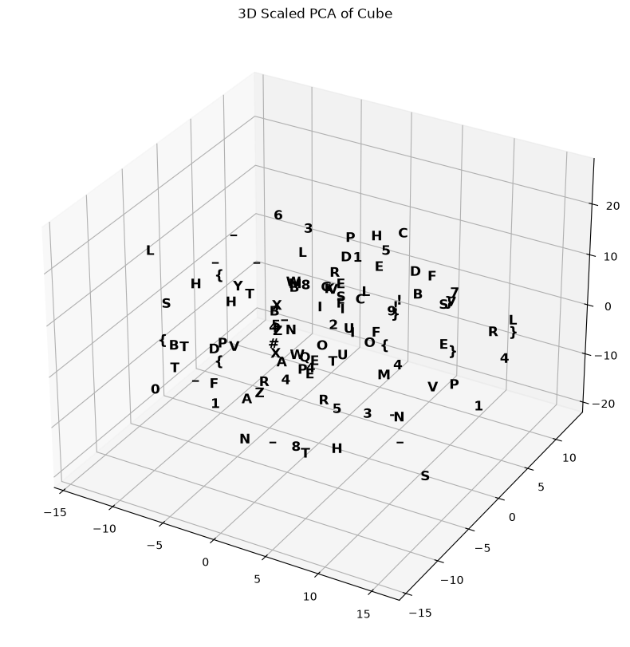

# Lost in Hyperspace 🚀

**Difficulty**: Medium 
**XP Reward**: 390
**Challenge Rating**: 5.0 (21 votes)

## Challenge Scenario
> A cube is the shadow of a tesseract casted on 3 dimensions. I wonder what other secrets may the shadows hold.

---

## 🛠️ Solution Write-Up

### Step-by-Step Solution: Uncovering the Flag

**1. Initial Reconnaissance (`.npz` inspection)**
We are given a file named `token_embeddings.npz`, which is a compressed NumPy archive. Inside, we found two arrays: a 1D array of 110 string characters (`tokens`), and a 2D array of shape `(110, 512)` (`embeddings`). Every single character has a unique 512-dimensional vector associated with it. 

**2. Casting Shadows (Dimensionality Reduction)**
The title of the challenge hinted at hyperspace, and 512 dimensions is impossible to visualize. To see what the data looked like, we used **Principal Component Analysis (PCA)** to cast a "shadow" of this 512D space down to lower dimensions. 
When initially squashed down to a 2D plane, the letters formed a scrambled, tilted grid. However, looking at the variances of the principal components, we realized the data had three significant dimensions, but the third component was scaled down.

**3. Discovering the 3D Structure**
When we scaled up the third principal component to match the variance of the first two and plotted them in a 3D scatter plot, the seemingly random cloud of characters aligned perfectly onto the edges and vertices of a **3D Cube**. The 512-dimensional embeddings were mathematically encoding 3D spatial coordinates!



**4. Tracing the Path (Nearest Neighbor Search)**
Knowing the flag format starts with `HTB{`, we needed to figure out how to read the text. In spatial datasets, continuous text is often written such that adjacent letters are physically close to each other. By writing a **Nearest Neighbor graph traversal script**—starting at the letter `H` and always drawing a line to the closest unvisited point in the original high-dimensional space—we traced a path that wrapped across the faces of the 3D cube. This continuous path perfectly spelled out our flag.

**Flag:**
```text
HTB{L0ST_1N_TH3_SP1R4L}
```

---

## 🧠 Concepts Mastered & Real-World Applications

To solve challenges like this, you need to understand the intersection of Data Science, Linear Algebra, and Machine Learning.

### 1. High-Dimensional Embeddings & Latent Spaces
* **What it is:** The practice of representing discrete objects (like words, images, or graph nodes) as arrays of continuous numbers (vectors).
* **Real-World Application:** This is the foundational mechanism behind **Large Language Models (like ChatGPT)** and **Search Engines**. When an AI reads text, it converts words into high-dimensional embeddings. Words with similar meanings are mathematically placed closer together in "hyperspace."

### 2. Dimensionality Reduction (PCA, t-SNE, UMAP)
* **What it is:** Mathematical techniques used to take data with hundreds or thousands of dimensions and compress it down to 2 or 3 dimensions so humans can visualize it.
* **Real-World Application:** Data scientists use these techniques extensively in **Bioinformatics** (clustering gene expression profiles) and **Customer Segmentation**.

### 3. Spatial Graph Algorithms (Nearest Neighbor / TSP)
* **What it is:** Algorithms designed to find the shortest path between points in a coordinate space, avoiding loops or redundant steps.
* **Real-World Application:** These algorithms are the backbone of **Logistics and Routing** (e.g., Google Maps, delivery route optimization) and **Robotics** for spatial navigation.
