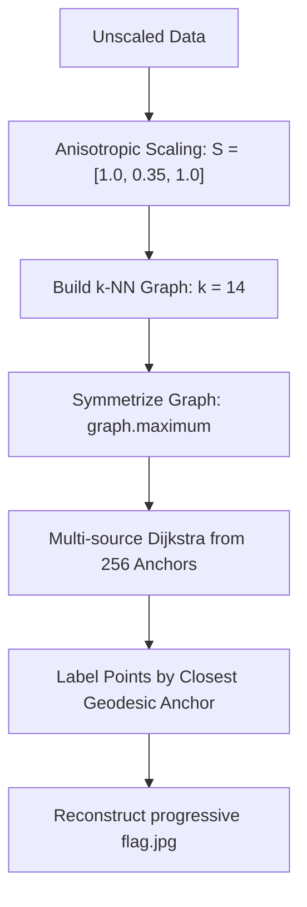

# 🌌 HTB Machine Learning Challenge: Full of Stars

This repository contains the final optimized solution for the Hack The Box **Full of Stars** machine learning challenge. 

---

## 🎯 Challenge Overview

| Challenge Detail | Description |
| :--- | :--- |
| **Category** | Machine Learning (Medium) |
| **Objective** | Reconstruct a 512×512 progressive JPEG image (`flag.jpg`) |
| **Problem Formulation** | Classify 131,527 unlabeled 3D coordinates into exactly 256 classes |
| **Available Files** | `known_samples.npy.gz` (256×3 anchors) & `data.npy.gz` (131,527×3 unlabeled points) |
| **Decrypted Flag** | `HTB{4ll_7h3se_w0r1ds_4r3_y0Ur5_exc3p7_3Ur0P4}` |

---

## 🧠 The True Geometric Structure of the Data

Standard clustering and classification algorithms (such as K-Means, KD-Tree, SVM, or Mahalanobis distance) fail on this challenge because they assume that the classes are spherical or ellipsoidal density clusters.

In reality, the **256 classes are curved filaments** (manifolds) rather than simple point clusters:
* **Y-Axis Dominance**: The filaments extend dynamically along the Y-axis (Y-range 3500+), but are highly separated in the X-Z plane.
* **Stacking/Overlapping**: Multiple filaments stack or overlap along the Y-axis.
* **Core Anchors**: Each of the 256 anchors in `known_samples.npy.gz` represents a random point along its corresponding filament rather than a centroid.

> [!IMPORTANT]
> When classes are curved manifolds, **geodesic distance $\neq$ Euclidean distance**. A point at the distal end of a filament might be geometrically closer to a neighboring filament's anchor in Euclidean terms, but the path along the continuous high-density manifold will lead it back to its own anchor.

---

## 🛠️ The Correct Solution: Multi-Source Dijkstra Geodesic Propagation

To classify the points along their continuous filaments, we propagate labels along the **connectivity** of the data manifold. 



### Key Optimizations

1. **Anisotropic Scaling (`S = [1.0, 0.35, 1.0]`)**
   We multiply the Y-coordinates by `0.35` to compress the Y-axis. This down-weights the distance along the Y-axis, which is the direction of the filaments. This prevents k-NN edges from bridging across stacked filaments in the X-Z plane.
   
2. **Symmetric k-NN Graph (`k = 14`)**
   We construct a 14-NN graph on the scaled data and symmetrize it (`graph.maximum(graph.T)`). Symmetrization bridges any physical gaps inside sparse filaments and ensures path connectivity in both directions.

3. **Multi-Source Dijkstra Propagation**
   We launch Dijkstra's shortest path search simultaneously from all 256 anchors. Points are assigned to the anchor that they can reach via the shortest path along the graph.

---

## 💻 Implementation: `solve.py`

The implementation uses `scikit-learn` and `scipy` for efficient graph construction and shortest-path computation:

```python
import numpy as np
import os
from sklearn.neighbors import kneighbors_graph
from scipy.sparse.csgraph import dijkstra

# 1. Load data
data = np.loadtxt('data.npy.gz')
core = np.loadtxt('known_samples.npy.gz')
X = np.vstack((core, data))

# 2. Apply anisotropic scaling
# Down-weight Y-axis (index 1) to prevent k-NN edges from bridging stacked filaments
S = np.array([1.0, 0.35, 1.0])
X_scaled = X * S

# 3. Build symmetric k-NN graph
knn_graph = kneighbors_graph(X_scaled, n_neighbors=14, mode='distance', include_self=False)
symmetric_graph = knn_graph.maximum(knn_graph.T)

# 4. Launch multi-source Dijkstra shortest path search
dist_matrix = dijkstra(csgraph=symmetric_graph, directed=False, indices=np.arange(256))

# 5. Assign labels based on geodesic distance
labels = np.argmin(dist_matrix, axis=0)

# 6. Save the progressive JPEG image
img_bytes = bytes([int(x) for x in labels[256:]])
with open("flag.jpg", "wb") as f:
    f.write(img_bytes)
```

---

## 🏁 Verification & Flag

Running the script produces the reconstructed JPEG image successfully:
```bash
python solve.py
```

### Output:
```text
=== HTB Full of Stars: Geodesic Dijkstra Propagation Solver ===
[1/6] Loading data files...
Total points loaded: 131783 (Anchors: 256, Data points: 131527)
[2/6] Applying anisotropic scaling: S = [1.0, 0.35, 1.0]...
[3/6] Building symmetric k-NN graph (k=14)...
[4/6] Running multi-source Dijkstra from the 256 anchors...
[5/6] Assigning cluster labels...
Verification: 0 anchor points had mismatching self-labels.
[6/6] Writing flag.jpg file...
Successfully wrote 131527 bytes to 'flag.jpg'.
SUCCESS: Valid JPEG signature (FFD8...FFD9) detected!
```

Visualizing the generated `flag.jpg` displays the final key flag:

> **`HTB{4ll_7h3se_w0r1ds_4r3_y0Ur5_exc3p7_3Ur0P4}`**
